<div align="center">

<!-- ====== GAME BOY HEADER ====== -->


<br />

<!-- ====== RETRO TITLE ====== -->

```
╔════════════════════════════════════════════════════════╗
║                                                        ║
║   ███████╗██████╗ ██╗   ██╗██████╗ ███████╗███╗   ██╗  ║
║   ██╔════╝██╔══██╗╚██╗ ██╔╝██╔══██╗██╔════╝████╗  ██║  ║
║   █████╗  ██████╔╝ ╚████╔╝ ██████╔╝█████╗  ██╔██╗ ██║  ║
║   ██╔══╝  ██╔══██╗  ╚██╔╝  ██╔══██╗██╔══╝  ██║╚██╗██║  ║
║   ███████╗██║  ██║   ██║   ██║  ██║███████╗██║ ╚████║  ║
║   ╚══════╝╚═╝  ╚═╝   ╚═╝   ╚═╝  ╚═╝╚══════╝╚═╝  ╚═══╝  ║
║                                                        ║
║                 Developer & Builder                    ║
║                                                        ║
╚════════════════════════════════════════════════════════╝
```

<br />

<!-- ====== BADGES ====== -->
<a href="https://github.com/OrenERY">
  
</a>
&nbsp;

&nbsp;


<br /><br />

<!-- ====== PIXEL STATS CARD ====== -->
<picture>
  <source media="(prefers-color-scheme: dark)" srcset="https://pixel-profile.vercel.app/api/github-stats?username=OrenERY&screen_effect=true&theme=green" />
  <source media="(prefers-color-scheme: light)" srcset="https://pixel-profile.vercel.app/api/github-stats?username=OrenERY&screen_effect=true&theme=green" />
  
</picture>

</div>

<!-- ====== ABOUT ====== -->
```
░░░░░░░░░░░░░░░░░░░░░░░░░░░░░░░░░░░░░░░░░░░░░░░░░░░░░░░░░░░░░░░░░░
░░  ABOUT                                                       ░░
░░░░░░░░░░░░░░░░░░░░░░░░░░░░░░░░░░░░░░░░░░░░░░░░░░░░░░░░░░░░░░░░░░
```

```
┌──────────────────────────────────────────────────────┐
│                                                      │
│  > Name .......... ERYren                            │
│  > Location ...... Indonesia                         │
│  > Role .......... Full-Stack Developer              │
│  > Focus ......... Web Apps, Computer Vision, IoT    │
│                                                      │
│  "Passionate about building software                 │
│   — from web apps to computer vision."               │
│                                                      │
└──────────────────────────────────────────────────────┘
```

<!-- ====== TECH STACK ====== -->
```
░░░░░░░░░░░░░░░░░░░░░░░░░░░░░░░░░░░░░░░░░░░░░░░░░░░░░░░░░░░░░░░░░░
░░  TECH STACK                                                  ░░
░░░░░░░░░░░░░░░░░░░░░░░░░░░░░░░░░░░░░░░░░░░░░░░░░░░░░░░░░░░░░░░░░░
```

<div align="center">

```
╔═══════════════╦═══════════════╦═══════════════╦═══════════════╗
║   LANGUAGES   ║   BACKEND     ║   FRONTEND    ║   TOOLS       ║
╠═══════════════╬═══════════════╬═══════════════╬═══════════════╣
║               ║               ║               ║               ║
║  Python       ║  Laravel      ║  Next.js      ║  Tailwind CSS ║
║  TypeScript   ║  Node.js      ║  React        ║  Git          ║
║  JavaScript   ║  REST APIs    ║  HTML / CSS   ║  Docker       ║
║  PHP          ║  IoT / ESP    ║  MediaPipe    ║  VS Code      ║
║               ║               ║               ║               ║
╚═══════════════╩═══════════════╩═══════════════╩═══════════════╝
```


</div>

<!-- ====== PROJECTS ====== -->
```
░░░░░░░░░░░░░░░░░░░░░░░░░░░░░░░░░░░░░░░░░░░░░░░░░░░░░░░░░░░░░░░░░░
░░  PROJECTS                                                    ░░
░░░░░░░░░░░░░░░░░░░░░░░░░░░░░░░░░░░░░░░░░░░░░░░░░░░░░░░░░░░░░░░░░░
```

```
┌──────────────────────────────────────────────────────┐
│  PROJECTS                                            │
├──────────────────────────────────────────────────────┤
│                                                      │
│  > cloud_based_lms                                   │
│    Cloud-based Learning Management System            │
│    Python                                            │
│                                                      │
│  > mediapie_computer_vision                          │
│    Computer vision projects with MediaPipe           │
│    Python                                            │
│                                                      │
│  > TryCycle                                          │
│    Full-stack web application                        │
│    Blade (Laravel)                                   │
│                                                      │
│  > Website-Kliniq                                    │
│    Modern clinic website                             │
│    TypeScript                                        │
│                                                      │
│  > PBWD                                              │
│    Interactive landing page                          │
│    JavaScript                                        │
│                                                      │
│  > IOT_Monitoring                                    │
│    IoT Monitoring Dashboard                          │
│    TypeScript                                        │
│                                                      │
└──────────────────────────────────────────────────────┘
```

<!-- ====== STATS ====== -->
```
░░░░░░░░░░░░░░░░░░░░░░░░░░░░░░░░░░░░░░░░░░░░░░░░░░░░░░░░░░░░░░░░░░
░░  STATS                                                       ░░
░░░░░░░░░░░░░░░░░░░░░░░░░░░░░░░░░░░░░░░░░░░░░░░░░░░░░░░░░░░░░░░░░░
```

<div align="center">


<br /><br />


</div>

<!-- ====== CONTRIBUTION GRAPH ====== -->
```
░░░░░░░░░░░░░░░░░░░░░░░░░░░░░░░░░░░░░░░░░░░░░░░░░░░░░░░░░░░░░░░░░░
░░  CONTRIBUTION GRAPH                                          ░░
░░░░░░░░░░░░░░░░░░░░░░░░░░░░░░░░░░░░░░░░░░░░░░░░░░░░░░░░░░░░░░░░░░
```

<div align="center">


</div>

<!-- ====== FOOTER ====== -->

<br />

<div align="center">

```
╔═════════════════════════════════════════════════════╗
║                                                     ║
║                   GAME  OVER                        ║
║                                                     ║
║         Thanks for visiting my profile!             ║
║         INSERT COIN to continue...                  ║
║                                                     ║
║             github.com/OrenERY                      ║
║                                                     ║
╚═════════════════════════════════════════════════════╝
```


</div>
